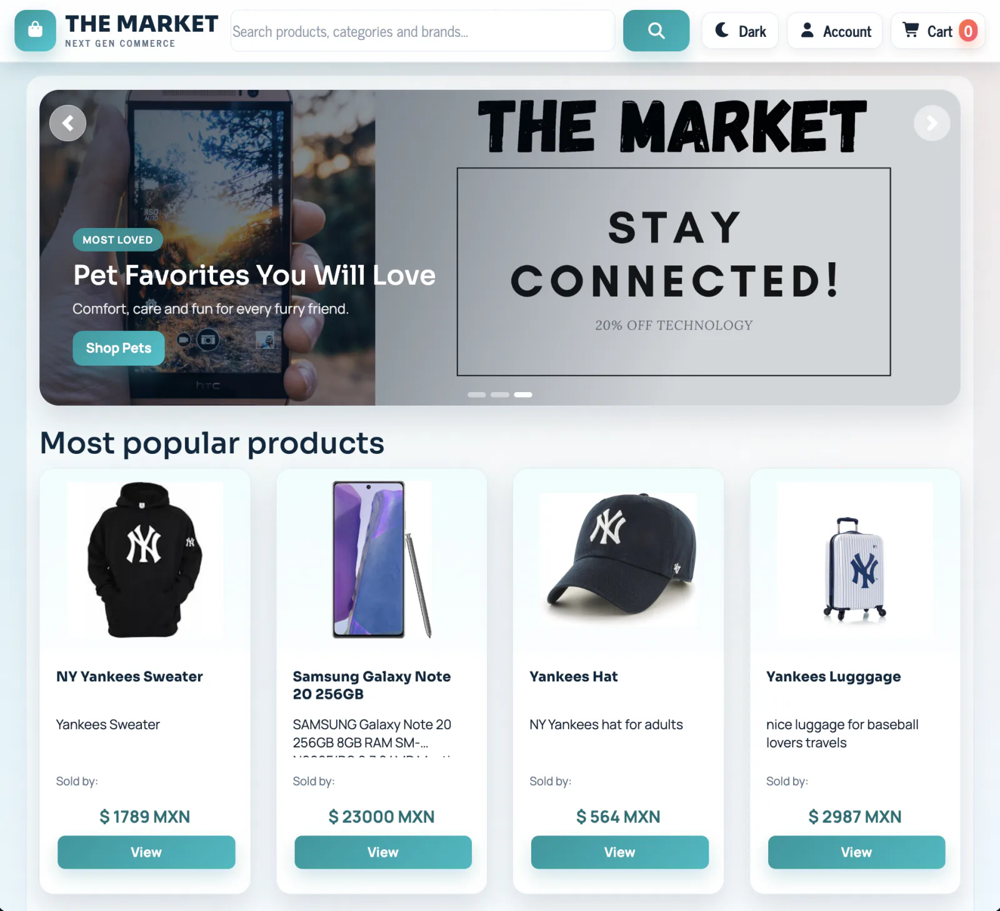

# 🛍️ Marketplace

### A MERN marketplace prototype with a storefront, admin panel, analytics, and Stripe checkout flow

This project is a full-stack marketplace app built with React + Express + MongoDB. It includes a customer shopping experience (browse, search, cart, checkout) and an admin workspace for managing products, categories, stores, sellers, and viewing dashboard charts.  
It feels like a practical e-commerce sandbox you can run locally, seed with sample data, and keep iterating on.


## ✨ Features

| | Feature | Why it matters |
|---|---|---|
| 🛒 | Customer storefront (home, category pages, product pages, search) | Covers the core shopping flow and makes it easy to demo catalog browsing. |
| 💳 | Stripe checkout with backend PaymentIntent route | Lets you test a real payment flow using Stripe test keys (frontend uses Stripe Elements). |
| 🧭 | Multi-step checkout with localStorage cart + progress guards | Cart state persists between pages and protects payment/confirmation route order. |
| 🧰 | Admin console for Products, Orders, Categories, Sellers, and Stores | Gives you one place to manage marketplace data from the UI. |
| 📊 | Dashboard charts (sales/store/order insights) | Adds analytics views using Chart.js for a more complete admin experience. |
| 🌗 | Theme toggle (light/dark) | Small UX touch that makes the app feel more polished. |


<p align="center">
  
</p>


## 🛠️ Tech Stack


## 🧩 Project Snapshot

- Backend: Express API + Mongoose models for `Consumer`, `Seller`, `Store`, `Product`, `Category`, and `Order`
- API routes: `/api/consumers`, `/api/login`, `/api/stores`, `/api/products`, `/api/productscat`, `/api/categories`, `/api/sellers`, `/api/orders`
- Payments: `POST /create-payment-intent` creates Stripe PaymentIntents based on cart items
- Frontend routes: customer storefront (`/home/...`), admin panel (`/admin`), and compact checkout flow (`/check/...`)
- Seed script: `npm run seed` resets and inserts sample data (products/orders)


## 🚀 Live Demo

<a href="https://marketplace.jorgeguzman.dev/" target="_blank" rel="noopener noreferrer">
  
</a>

<a href="https://portfolio.jorgeguzman.dev/" target="_blank" rel="noopener noreferrer">
  
</a>


## 💻 Run it locally

```bash
git clone https://github.com/jorguzman100/marketplace.git
cd marketplace
npm install
cp .env_example .env
cp client/.env_example client/.env
npm start
```

Optional sample data (this clears and reseeds product/order collections):

```bash
npm run seed
```

Local URLs:

- Frontend: `http://localhost:3000`
- API: `http://localhost:3001`

<details>
<summary>🔑 Required environment variables</summary>

```env
# .env (backend)
MONGODB_URI=mongodb://localhost/reactreadinglist
STRIPE_SECRET_KEY=sk_test_replace_me
PORT=3001
# client/.env (frontend)
REACT_APP_STRIPE_PUBLISHABLE_KEY=pk_test_replace_me
```
</details>


## 🤝 Contributors

- **Raul Alarcon**  ·  [@raul-ae](https://github.com/raul-ae)
- **Rodrigo Rosas**  ·  [@rodrigorosasv](https://github.com/rodrigorosasv)
- **Jorge Guzman**  ·  [@jorguzman100](https://github.com/jorguzman100)
